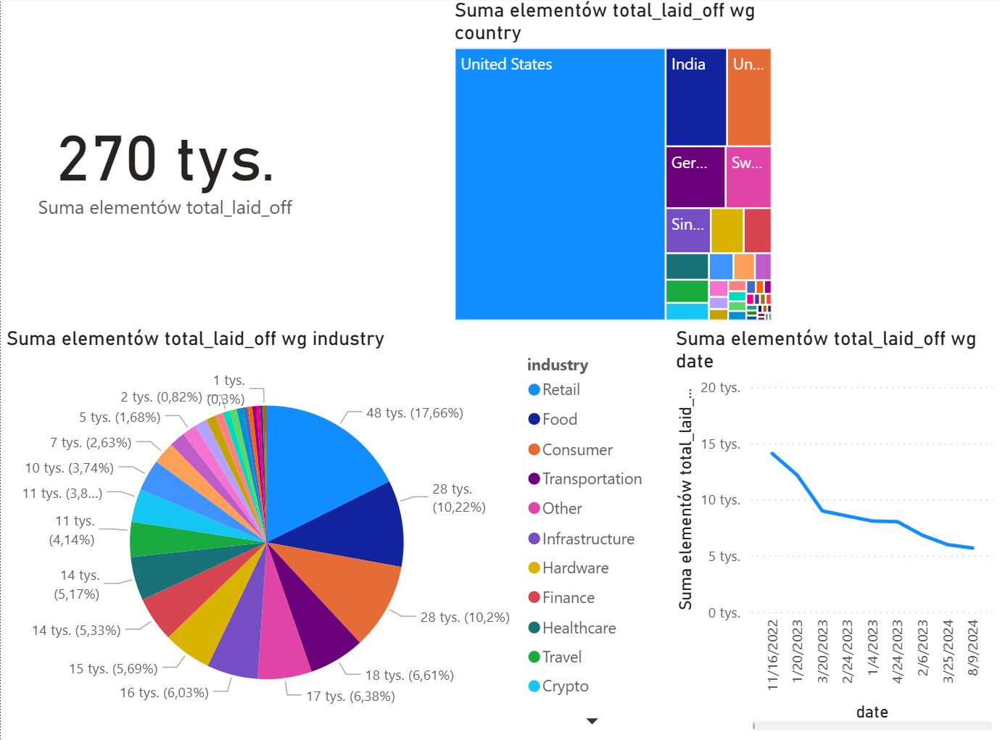

SQL Data Cleaning Project: Layoffs 2022

Project Objective

The goal of this project was to perform data cleaning on a raw dataset of company layoffs using SQL (MySQL). The script prepares the data for exploratory data analysis (EDA) and visualization by addressing duplicates, inconsistencies, and missing values.

Source: Kaggle Layoffs 2022 Dataset

Tools Used

SQL (MySQL)

Data Cleaning Process

The data_cleaning_layoffs.sql script follows these structured steps:

Create Staging Table: A copy of the raw data (layoffs) is created as layoffs_staging to ensure the original data remains unmodified.

Remove Duplicates: A second staging table (layoffs_staging2) is created, adding a row_num column using the ROW_NUMBER() window function. All rows with row_num > 1 are identified as duplicates and deleted.

Standardize Data:

Industry: Unified various 'Crypto' related entries into a single 'Crypto' category.

Country: Trimmed trailing periods from country names.

Date: Converted the date column from a text/string type to the proper DATE format for analysis.

Handle Null & Blank Values:

Converted blank values ('') in the industry column to NULL.

Populated NULL industry values by cross-referencing other records from the same company using a self-join.

Remove Unnecessary Data:

Deleted rows where both total_laid_off and percentage_laid_off were NULL, as these records are not relevant for an analysis of layoff events.

Final Cleanup: The temporary row_num column was dropped from layoffs_staging2.

## Power BI Dashboard

A dashboard visualizing the cleaned layoffs data to highlight key trends by industry, country, and over time.

